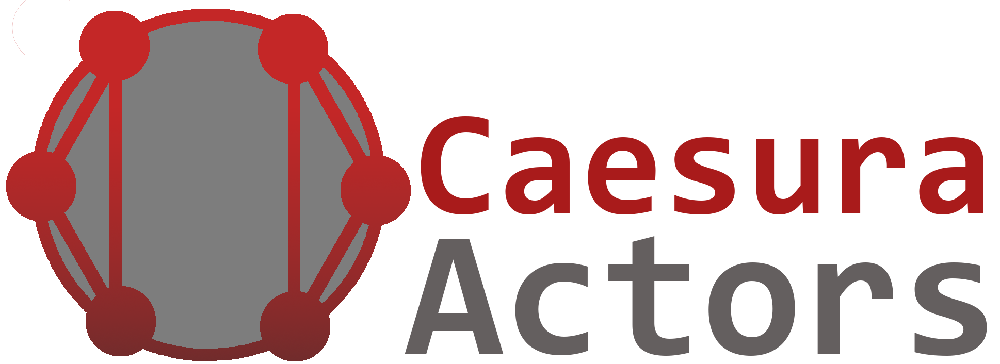

**THIS IS A PROTOTYPE, FINAL PROJECT WILL BE REWRITTEN IN A NEW REPOSITORY**

Caesura.Actors is an actor framework for creating a straight-forward and configurable actor system. It is primarily targeted at providing the actor paradigm as a programming practice rather than as a microservice framework.

This project was created for [Solace](https://github.com/kameko/Solace).

## Copyright and license

Caesura.Actors is copyright 2019 Kameko. All images and logos are copyright 2019 Kameko. Source code is licensed under the Microsoft Public License (MS-PL).
